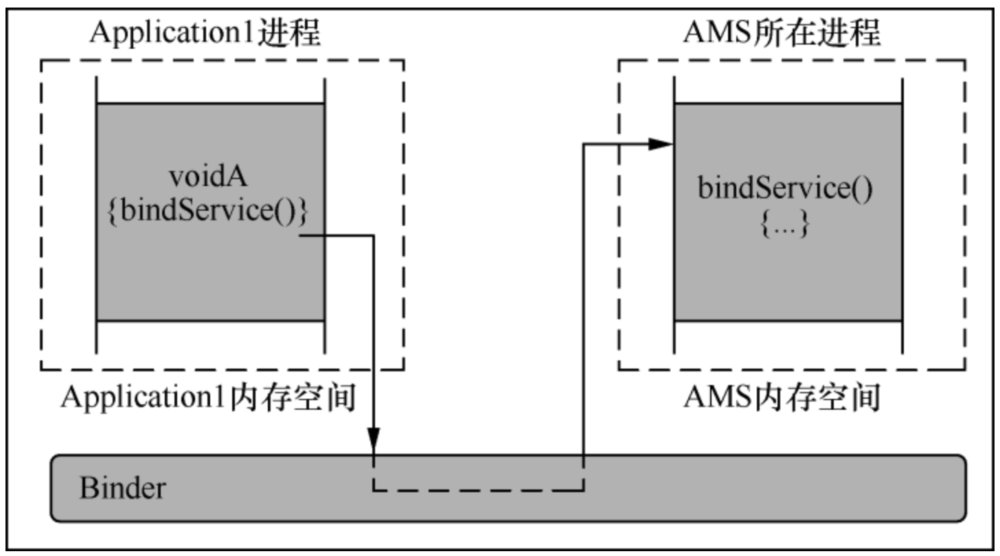
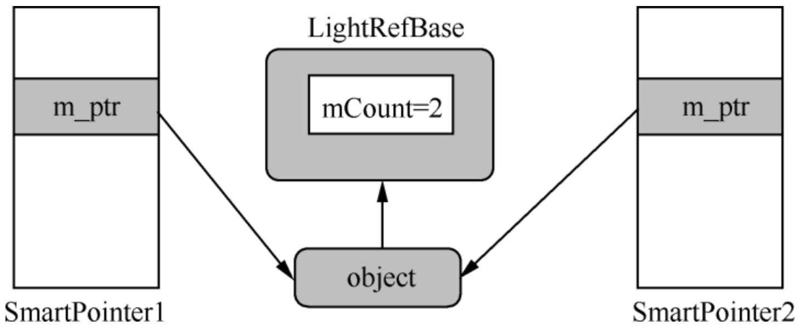
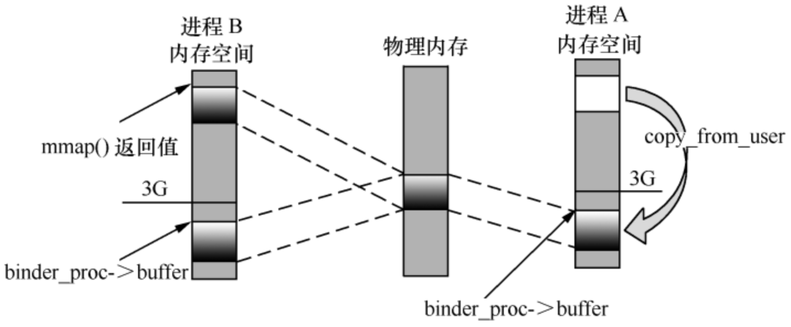
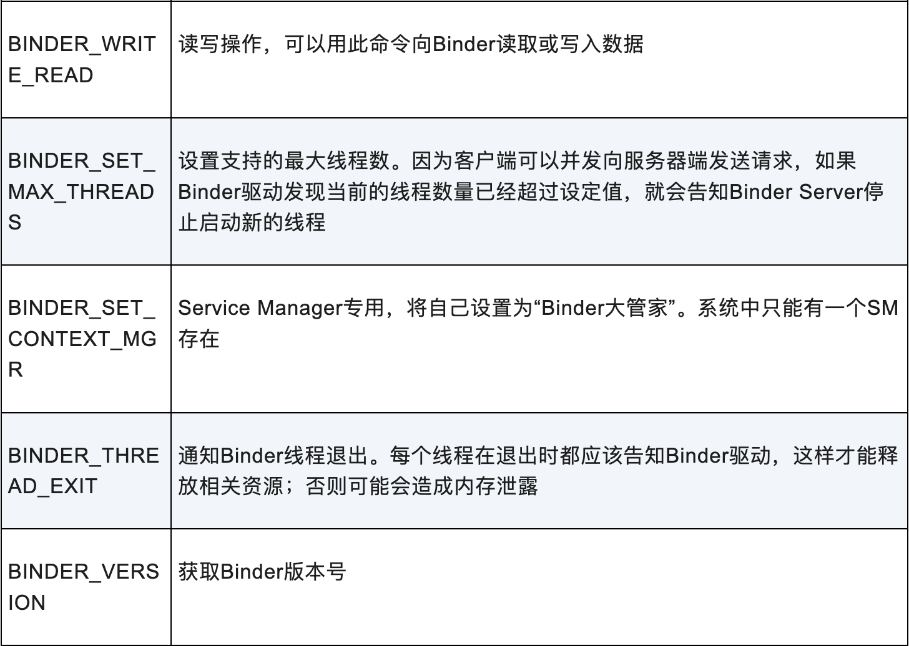
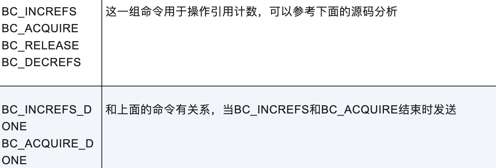
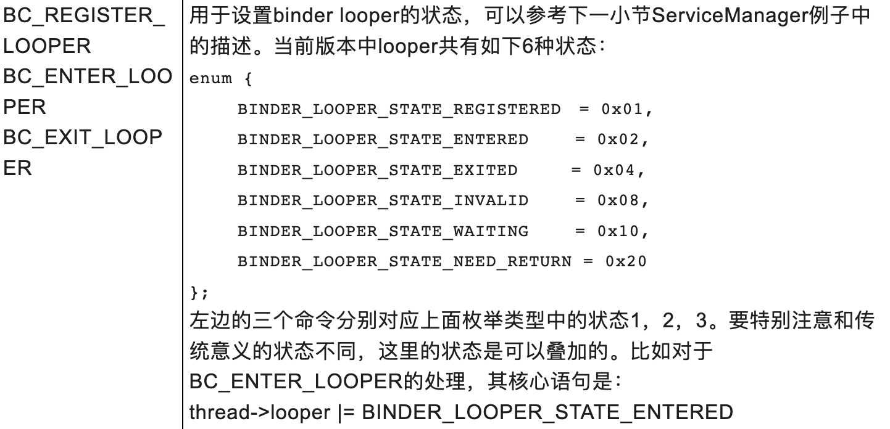
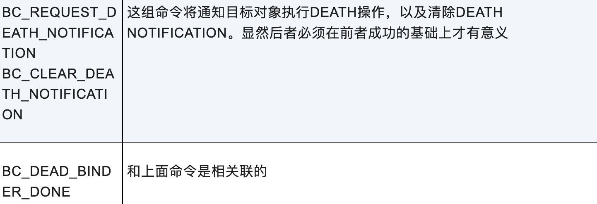
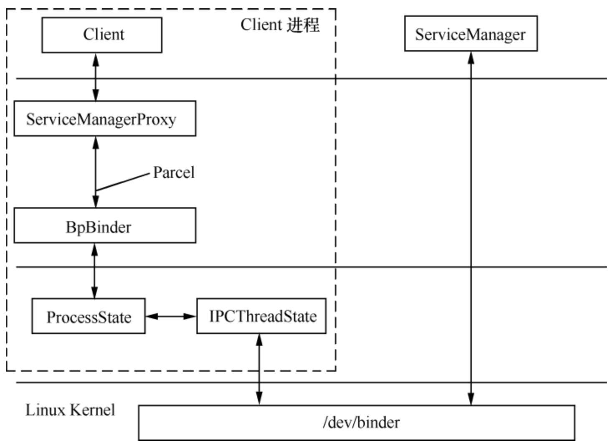
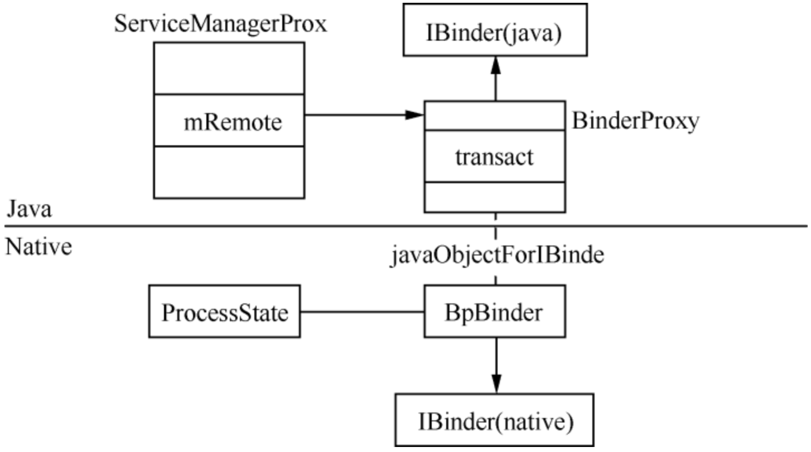
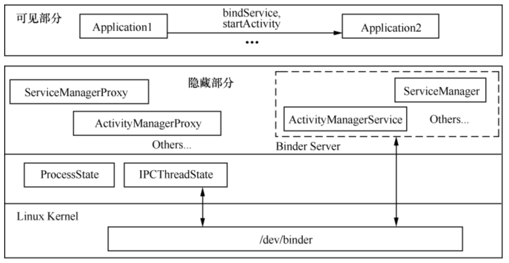

- 同一程序的两个函数/方法之间能直接调用的根本原因是它们处于相同的内存空间
- 两个不同的进程之间没有办法直接访问对方内部的函数/方法或变量
- 借助Binder间接访问

组成元素：
- Binder驱动（路由器）
- Service Manager（DNS）
- Binder Server（服务器）
- Binder Client（客户端）
## 智能指针
主要用于自动管理对象的生命周期，避免内存泄漏和野指针问题。

- 分为强指针sp、弱指针wp
- 目标object父类是RefBase——提供引用计数器，进行强弱引用的控制
- incStrong同时增加强、弱引用
- incWeak只增加弱引用
## 数据传递载体 Parcel
- 专门为Binder IPC设计
- 用于序列化（Flattening）和反序列化数据的容器
- 用于承载希望通过IBinder发送的相关信息，包括基本数据和对象，具备打包和重组能力

1. Parcel是一个native内存缓冲区的封装
2. writeToParcel将Java对象数据通过JNI转化为字节序列写入缓冲区
3. Binder机制负责将缓冲区数据跨进程高效复制
4. createFromParcel通过JNI将复制过来的缓冲区数据按顺序读取、并在Java层重建对象
5. 底层缓冲区可能包含类型、长度元数据，辅助读写
## Binder 驱动与协议
### Binder驱动
- 标准的Linux驱动（将自己注册成一个misc device，并向上层提供一个/dev/binder节点）
- 不对应真实的硬件设备
- 运行于内核态
- 提供open、mmap、ioctl等常用的文件操作
### open
- 上层进程在访问Binder驱动时，首先要打开/dev/binder节点
- Binder驱动会在/proc系统目录下生成各种管理信息，binder_proc是对应的记录体（每个进程独立对应一个），先对它进行各种初始化，接着把它加入Binder的全局管理中
- 简单说，Binder驱动为用户创建一个对应的binder_proc，之后用户对Binder的操作都将基于此进行
### mmap
 - 应用进程通过open、mmap与Binder驱动建立联系后，应用进程通过mmap得到一个虚拟内存地址（通过虚拟内存转换最终指向物理内存某个位置），Binder驱动通过mmap拥有一个指向某个虚拟内存地址的指针（经过虚拟内存转换后与应用程序指向的物理内存处于同一位置）
 - 应用程序与Binder驱动拥有若干共用的物理内存块，它们对各自内存地址的操作，实际上是在同一物理内存上执行
 - Binder只用一次复制、实现两个进程之间数据共享

### ioctl
承担Binder驱动大部分业务，可以完全替代read、write等常规文件操作，支持的命令：

BINDER_WRITE_READ又分为若干子命令：
1. 
2. 
3. 
4. 
## ServiceManager（Binder Server）
为了完成“Server Name”（域名）和“Server Handle”（IP地址）之间对应关系的查询而存在，提供的服务：
- 注册：当一个Binder Server创建后，将自己的【名称、句柄】对应关系告知SM进行备案
- 查询：Client程序向SM发起查询请求，获得Binder Server对应的句柄
- 其他信息查询：SM版本号、当前状态等

（旧版本）内部维护一个svclist列表，用于存储所有Server相关信息（数据结构为svcinfo），注册、查询操作都基于此展开。
### ServiceManager启动、构建、获取
1. 在init程序解析init.rc时启动，保证有人使用Binder机制前就处于工作状态
2. 启动之后所做工作：
	1. 打开Binder驱动（open）
	2. 执行mmap
	3. 设置成为管家（ioctl）
	4. 进入循环、等待请求（典型的基于事件驱动的程序循环框架，ioctl读取，处理BR_TRANSACTION）
3. Client访问SM（Binder Server）流程：
	1. 打开Binder驱动
	2. 执行mmap
	3. 通过Binder向SM发送请求
	4. 获得结果

- 每个进程只允许打开一次Binder、且只做一次mmap
- 提供更好的封装使SM调用更精简
- ProcessState用来专门管理应用进程的Binder操作，执行Binder的一系列命令、且对上层用户“透明”
- IPCThreadState与Binder进行实际命令通信，进程中的每个线程都能与Binder通信、且是阻塞式的
- ServiceManagerProxy对SM提供的服务进行封装（本地代理与服务中心接口一致、且透明实现远程交互）
- ServiceManagerProxy通过BpBinder（基于ProcessState和IPCThreadState）使用Binder驱动

### ServiceManagerProxy
- ServiceManager在ServiceManagerProxy上又封装一层，应用程序使用起来更加方便
- ServiceManagerProxy由ServiceManagerNative.asInterface(BinderInternal.getContextObject())创建
- ServiceManagerProxy的构造方法中传入了IBinder对象

xxx.Stub.Proxy中接口的实现：
1. 通过Parcel打包数据
2. 利用IBinder.transact将请求发送出去，IBinder会在内部使用ProcessState、IPCThreadState与Binder驱动通信
3. transact之后获取结果，阻塞式调用（Binder驱动先将调用者线程挂起，直到有结果才把它唤醒）
4. 客户端与服务端使用的业务代码一致
### IBinder、BpBinder
Binder提供的功能统一在IBinder接口中表示，关键方法：
- queryLocalInterface
- transact

IBinder的具体实现类：
- 在native层为BpBinder.cpp，由ProcessState的getContextObject创建
- 在Java层为BinderProxy.java，由JNI函数javaObjectForIBinder根据BpBinder创建
- BinderProxy的transact通过BpBinder的transact处理
- 最终通过IPCThreadState的transact处理

### ProcessState、IPCThreadState
- 同一进程中只存在一个ProcessState实例
- 只在ProcessState对象创建时才打开Binder驱动、执行mmap
- ProcessState中有一个全局列表记录所有与Binder相关的信息，每个表项是一个handle_entry，其中的binder属性是一个BpBinder
- BpBinder的mHandle代表Proxy的主人（比如SM为0）
- IPCThreadState线程单实例
- IPCThreadState负责与Binder驱动进行具体的命令交互，由其transact函数完成
- Transaction的flag：TF_ONE_WAY（当前业务是异步的），TF_ACCEPT_FDS（允许回复中包含文件描述符）
- IPCThreadState中talkWithDriver函数是与Binder驱动真正进行通信的地方，执行ioctl(mProcess->mDriverFD, BINDER_WRITE_READ, &bwr)
- Binder执行过程阻塞式/同步操作：Binder让调用者进程暂时挂起，直到目标进程返回结果后，Binder再唤醒等待的进程？
- copy_from_user？
- Binder驱动binder_transaction函数：
	1. 找到目标对象的target_proc和target_thread，得到target_list(todo列表)和target_wait（wait列表）
	2. 生成binder_transaction变量（t，用于描述本次要进行的transaction），将其加入目标线程todo列表（当目标对象被唤醒时，就可以从这个队列中取出需要做的工作）
	3. 生成binder_work变量（tcomplete，用于说明当前调用者线程有一个尚未完成的transaction），将其加入本线程todo列表
	4. 填写binder_transaction数据（from，to_proc，to_thread，code，buffer）
	5. buffer用于完成本条transaction，[[#mmap]]相关的内存区域，申请到内存后，从用户空间把数据复制过来
	6. 根据需要唤醒目标对象，接着分两条路进行
	7. 调用者这边将最终进入等待
	8. ？
## Binder Client

App如何通过bindService启动其他进程的Service：
1. App填写Intent、调用bindService发起请求
2. 与AMS取得联系（调用ContextImpl.bindService，借助SM获取AMS Proxy）
3. AMS找到与Intent最匹配的组件、并向它发送绑定请求，如果目标进程还不存在，AMS要先启动它
4. 目标进程响应绑定、完成具体操作后通知AMS，后者再回调发起请求的App
## AIDL
用于定义客户端/服务端通信接口的描述语言。

构建一个Binder Server所需工作：
- 启动的时机
- 提供一致的服务接口
- 与Binder驱动交互（open、mmap、ioctl）
- 提供访问的方式：实名、匿名

IMyAidlInterface.aidl文件经过转化后生成以下内容：
1. public interface IMyAidlInterface extends android.os.IInterface：在AIDL中，所有服务接口都继承自IInterface，在此基础上声明服务所提供的方法
2. public static abstract class Stub extends android.os.Binder implements IMyAidlInterface：嵌套在IMyAidlInterface中，包含方法asInterface、asBinder、onTransact，通常Binder Server的实现类继承自它，同时面向服务器和客户端
3. private static class Proxy implements IMyAidlInterface：嵌套在Stub中，面向Binder Client，让调用者轻松构造Binder Server的本地代理对象

BBinder是Server和IPCThreadState沟通的桥梁：
- Stub继承自Binder
- Stub构造过程中调用attachInterface设置owner、descriptor
- Binder构造过程中调用native方法生成[[#^17ff0a|JavaBBinderHolder]]，并保存其指针值到成员变量mObject中
- 基于AIDL的Server创建时，就已经预计要生成BBinder，只不过是等到有人真正使用它进行跨进程传递时才会实施

把WMS注册到SM中：
1. addService
2. Parcel.writeStrongBinder
3. ibinderForJavaObject
4. JavaBBinderHolder.get，因为第一次调用，所以创建一个JavaBBinder对象
5. Parcel.flattenBinder，将JavaBBinder强引用写入Parcel（type为BINDER_TYPE_BINDER，cookie为BBinder）
6. 后续向Binder驱动发起ioctl时，BBinder作为数据部分发送过去
7. 在Binder驱动的设计中，只要用户携带一个Binder对象经过Binder驱动，就会被记录下来（proc->nodes）
8. 在target_proc中添加一个指向此binder_node的引用，当target被唤醒时，它的proc中已经有了指向binder_node的binder_ref节点？
9. SM是target_proc，拥有了一个描述WMS的binder_node引用，当通过getService发起查询时，SM就可以告知WMS所在位置
10. Server进程IPCThreadState的executeCommand中，得到BBinder、并调用其transact函数
11. 接着调用BBinder的onTransact，被JavaBBinder重载
12. JavaBBinder的onTransact重点就是调用Java层Binder对象（AIDL中Stub的父类）的接口execTransact把请求传递过去
13. 接着调用Binder的onTransact，AIDL自动生成的Stub已经重写该方法
14. 在编写基于AIDL的Server时，只需实现相应的业务处理接口即可

JavaBBinderHolder： ^17ff0a
- 内部持有一个[[#^04411e|JavaBBinder]]弱引用
- 提供get方法获取内部JavaBBinder的强引用（promote转换）
- 对象新建时并没有立刻生成JavaBBinder，而是等用到时才真正创建出来

JavaBBinder： ^04411e
- 继承自BBinder
## 匿名 Binder Server
- 没有在SM中注册
- 好处是提高安全系数
- 必须借助其他手段才能被Client访问到，比如依靠实名Server

只要经过Binder驱动且以前还未出现的Binder对象，都会被记录下来：
- 实名Binder Server，通过addService把Server添加到SM时第一次经过Binder驱动，会被记录到binder_node，并在SM进程信息中添加binder_ref引用
- 匿名Binder Server，如IWindowSession，在Binder Client调用WMS的openSession时，生成一个Session对象，作为reply传递时第一次经过Binder驱动，会被记录到系统服务进程的proc->notes中，且target_proc（）会有一个binder_ref指向此binder_note